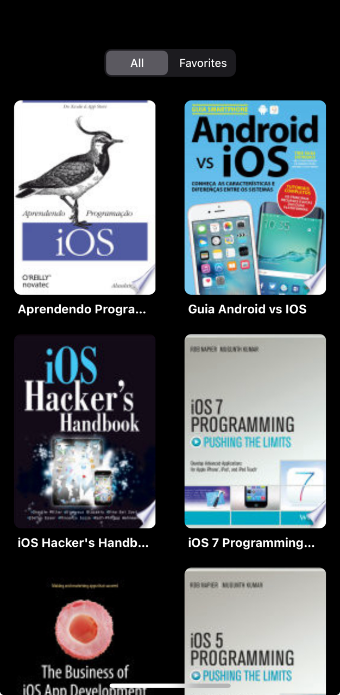
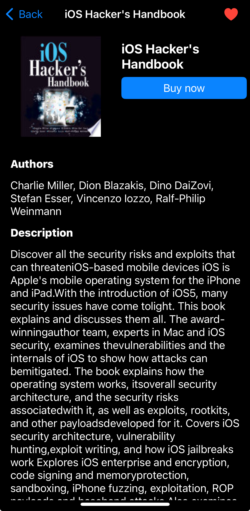
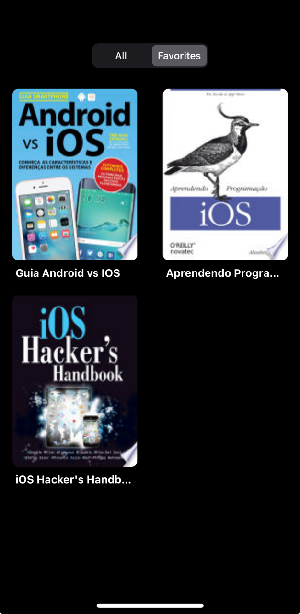

# SIBS iOS and C++ SDK Challenge

This challenge is based on the following requirements:

## Book Store
- Book Store consists on a simple 2-column list of available books about mobile
development. Using google’s api for books, the app should fetch and display the Thumbnail of a few
books at a time and load more as the user scroll’s through the list. References:
    - [Rest API](https://developers.google.com/books/docs/v1/getting_started#REST)
    - [Example API Call](https://www.googleapis.com/books/v1/volumes?q=ios&maxResults=20&startIndex=0)
- The list should also have a button to filter/show only books that the user has set as favorite.
- When the user clicks on one of the books, the app should present a detailed view displaying the
most relevant information of the book: Title, Author, Description and, if available, a Buy link.
- In the detail view, the user can also favorite or “unfavorite” a book. This option should be stored
locally so it persists through each app usage.
- Clicking on the Buy link should open the link on safari/chrome.

This app must be build following this rules:

1. All the API integrations must be built using C++.
   1. The app should call this api method and receive a callback with the API result (a json object or an error).
2. An APP built using Objective-c/Java that import and use those C++ class.
3. It is very important show your experience with testing;

Nice to have:
- Favorites in local storage using C++

## Results

All the requirements for the challenge where match:

- [x] API integration built with C++, `libcurl` and `jsoncpp`(for parsing)
- [x] Favorites storage built with C++ and `sqlite3`
- [x] Home screen which recycle every `UICollecitonViewCell` when they leave screen and loads more items when the user reaches the end of the listing
- [x] Details screen with favorite button and buy button (if buyLink is available)
- [x] Favorites screen listing from local storage
- [x] Unit tests for Favorites local storage

| Screen | Screenshot |
|:--------:|:------:|
|  Home  |   |
| Detail |   |
| Favorites | |

